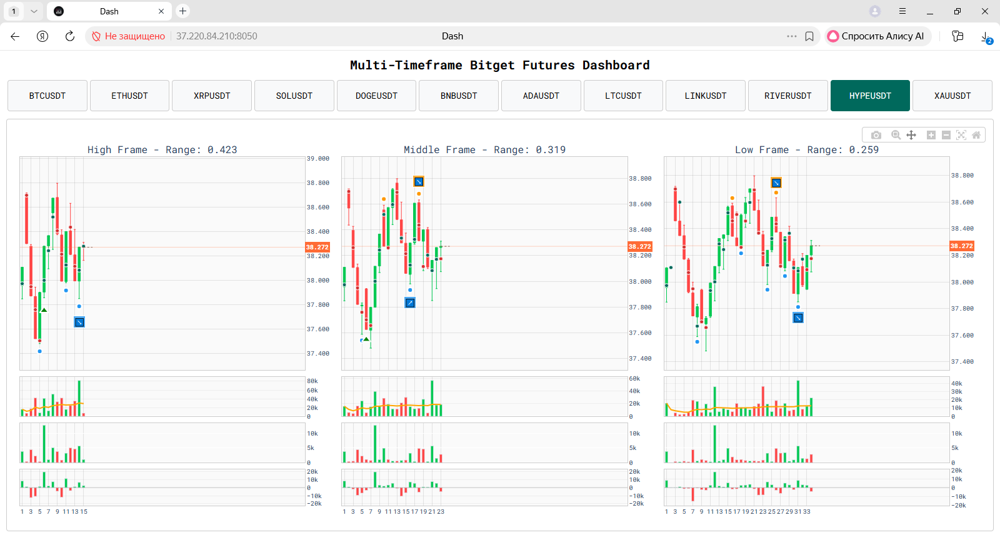

# bitget-trading-bot

**EN:** An async futures trading bot built around a single idea: 
volume distribution across swing phases reveals optimal exit behavior.

**RU:** Асинхронный торговый робот, построенный на следующей идее:
распределение объёма по фазам ценового движения отражает оптимальное поведение участника при управлении позицией.

---

## The Idea / Идея

**EN:**
Range bars fix price movement, not time. Each bar covers an identical price interval — making it a natural histogram bin. A price swing from origin to target becomes a statistical sample: a distribution of volume across equal price increments. To reduce noise and isolate a potential single large position within the overall flow, the bot tracks not the full volume profile across all price levels, but the dominant level of each bar — the price with the highest volume — along with its aggression side: whether the initiative belongs to the buyer (green offer in the tape) or the seller (red bid). This is, in effect, a simplified footprint.

In essence, volume × price range = work, in the physical sense. Range bars normalize the "distance" component, so volume becomes directly comparable across bars — a clean measure of market effort per unit of price movement.

**RU:**
Рейндж-бары формируются по фиксированным ценовым диапазонам одной длины (время не учитывается явным образом), — и по сути являются бинами гистограммы объема. Отдельный сегмент рыночного движения ("свинг"/"нога" - название на выбор трейдера) может рассматриваться как статистическая выборка: распределение объёма по равным ценовым шагам. Вместе с тем, из общего торгового объема ("сигнал + шум") уместно выделить ту его часть, которая могла бы составлять уникальную, изолированную позицию ("сигнал"). С этой целью вместо полного профиля объема по всем уровням рассматривается только доминирующий уровень каждого бара, и учитывается его "сторона" - принадлежит инициатива покупателю (зеленый офер в ленте), либо продавцу (красный бид). По сути, это упрощенный футпринт.

В качестве физической аналогии можно привести такое определение: объём × диапазон цены = работа. Рейндж-бары нормируют расстояние, поэтому объём становится сопоставимым между барами. Таким образом мы получаем меру рыночного усилия на единицу ценового движения.

---

## The Model / Модель

**EN:**
The model makes no assumptions about "smart money" or institutional actors. It describes something simpler: what does rational behavior look like for any participant who needs to exit a position?

The constraint is straightforward: if you have accumulated a significant position, you cannot exit with a single market order without moving price against yourself. The optimal solution is to place limit orders and let aggressive counterparties come to you — exit into strength, sell into buying pressure. Crucially, what is mechanically forced upon a large position is simultaneously optimal behavior at any scale.

This mechanics is scale-invariant. It applies equally to a retail trader managing a large-for-them position and to a hedge fund unwinding a block. Moreover, it does not matter who is on the other side — we can treat the aggregate market as a single personified counterparty.

What we observe is the footprint of this behavior: distribution volume must be at least equal to accumulation volume (ratio ≥ 0.9). If accumulation significantly exceeds distribution, the position was not fully unwound. No reversal expected. Additional structural requirements on phase shape are described in the code.

**RU:**
Модель не апеллирует явным образом к концепции "умных денег" или действиям больших игроков. Напротив, она опирается на общее место, стараясь ответить на очевидный вопрос: каково будет рациональное поведение всякого участника, которому необходимо выйти из позиции? Поясним.

Тривиально утверждение: если вы накопили значительную позицию, то не можете выйти одним рыночным ордером, не сдвинув цену против себя. Оптимальное решение — выставить лимитные ордера и ждать, когда агрессивные контрагенты придут к вам — "выходить в силу", "продавать в покупки". Однако, то, что продиктовано механически обусловленным ограничением для крупной позиции (в сравнении с общим рынком), в то же время отражает оптимальное управление позицией любого размера.

Механика выхода не зависит от масштаба торговли. Она одинаково применима и к розничному трейдеру с чувствительной позицией, и к хедж-фонду при выходе из большого объема. 
Более того, не играет роли, кто торгует против нас. Нам этого и не нужно знать, и мы можем воспринимать общий рынок как персонифицированного контрагента.

Мы стремимся обнаружить признаки этого поведения при распределении объёма в свинге: фаза распределения не должна быть меньше фазы накопления. Если накопленный объём значительно превышает объём в фазе распределения, полагаем, что позиция не была полностью закрыта. Разворота не ожидается. Параллельно, определенные требования накладываются на структуру и форму фаз (технические пояснения содержатся внутри кода в соответствующих функциях).

---

## How It Works / Механизм

**EN:**
For each ticker and so-called timeframe, the bot continuously monitors for swing extremums — peaks and troughs — on range bars.

When an extremum is detected, the bot identifies the origin of the preceding movement and analyzes the volume distribution across the swing from origin to target.

**Phase analysis:**
The swing is split into two phases at the bar of maximum volume:
- Accumulation: from origin to the volume peak
- Distribution: from the volume peak to target

The core condition: distribution volume must be at least 90% of accumulation volume (ratio ≥ 0.9). This is the "position was unwound" check. If accumulation significantly exceeds distribution — no signal.

**Distribution shape:**
We do not require a perfect bell curve. Instead, we explicitly favor a short accumulation phase followed by a longer distribution — the volume peak should fall in the first half of the swing. This structure suggests a sharp entry followed by a gradual exit via limit orders. We verify:

- Phase volume ratio (distribution ≥ 90% of accumulation)
- Peak position in the first half of the swing
- Negative slope of the distribution phase (volume fading as the position unwinds)

The use of skewness and entropy as shape metrics is a matter of ongoing experimentation; structural filters are currently preferred.

**Delta confirmation:**
In the distribution phase, aggressive buyers should be hitting offers — generating positive delta. A participant exiting via limit sells needs that buying pressure. So delta_distribution > 0 is added as a confirmation filter. The reverse is true for sell-side trade.

**Signal trigger:**
Three-bar construction at the extremum confirms the turn. Entry on the close of the signal bar. The maximum volume level of the signal bar and the preceding bar must both show aggression on the same side as the reversal, and the dominant volume of the signal bar must be lower than that of the preceding bar — indicating that aggressive pressure is fading at the entry point.

**RU:**
Для каждого тикера и таймфрейма (в условном понимании для данной стратегии) бот непрерывно отслеживает экстремумы свингов — пики и донья — на рейндж-барах.

При обнаружении экстремума бот определяет начало предшествующего движения и анализирует распределение объёма по свингу от начала до целевого бара.

**Анализ фаз:**
Свинг делится на две фазы в точке максимального объёма:
- Накопление: от начала до пика объёма (бар, на который пришелся максимальный объем)
- Распределение: от пика объёма до целевого бара

Ключевое условие: объём распределения должен составлять не менее 90% объёма накопления (соотношение ≥ 0.9). Это и есть основание полагать, что позиция была закрыта. 
Если накопление значительно превышает распределение — сигнала нет.

**Форма распределения:**
Мы не требуем идеального колокола в понимании нормального распределения. Более того, выбрана установка, чтобы фаза накопления была короче фазы распределения (пик объема должен приходиться на первую половину свинга). Что можно было бы описать наличием правосторонней ассиметрии (skew положительный)  - однако, в данной модели предпочтение отдается структурным фильтрам, а применение метрических статистик является предметом экспериментов.
Таким образом, проверяем набор технических условий:
- Соотношение объема в фазах.
- Позиция пика.
- Наклон распределения (slope). Отрицательное значение говорит о том, что объем в фазе распределения плавно падает.

**Подтверждение дельты:**
В фазе распределения длинной позиции ожидается, что агрессивные покупатели будут бить по офферам, генерируя положительную дельту. Участник, выходящий лимитными ордерами, 
поглощает давление покупателей. Условие delta_distribution > 0 используется как фильтр подтверждения. Обратная логика применяется к продажам.

**Триггер сигнала:**
Трёхбарная конструкция на экстремуме (в конце движения) подтверждает разворот и является местом входа - по закрытии сигнального бара. Проторговка максимального объема (на оффере/на биде) должна совпадать с направлением разворотного бара, а максимальный объем последнего бара свинга - его target - должен быть меньше разворотного.

---

## Stack / Технологии

**EN:**
- **Python 3.12** — async core via `asyncio`
- **BitGet Futures API** — market data & order execution. Custom, hand-crafted BitGet API client built from scratch following official documentation. Both limit and market order entries are implemented. Limit orders proved unreliable in practice due to WebSocket order channel read errors and resulting SL/TP management issues. Market entries are preferred despite higher commission cost.
- **Redis** — real-time candle state, data persistence during session (in case of script termination)
- **Plotly Dash** — live dashboard with candlestick charts, volume histogram, delta histogram
- **GARCH (arch library)** — volatility estimation for range-bar construction
- **scipy, numpy** — swing volume distribution analysis
- **aiohttp** — async HTTP client for exchange communication

**RU:**
- **Python 3.12** — асинхронное ядро на `asyncio`.
- **BitGet Futures API** — рыночные данные и исполнение ордеров. Модуль самописный, собран по документации биржи. Предусмотрены два типа входов: лимитными и рыночными ордерами. Однако, применение отложенных ордеров сопряжено с большим количеством ошибок при чтении канала ордеров веб-сокетом и, как следствие, неудовлетворительным управлением стопами и тейками. Предпочтение отдается рыночным ордерам, несмотря на большую стоимость комиссий и неоптимальность точек входа.
- **Redis** — состояние свечей в реальном времени, хранение данных внутри сессии (на случай остановки скрипта робота).
- **Plotly Dash** — дашборд в реальном времени: свечи, гистограммы объёмов, гистограмма дельты.
- **GARCH (библиотека arch)** — оценка волатильности для расчета диапазонов рейндж-баров.
- **scipy, numpy** — анализ распределения объёма свинга.
- **aiohttp** — асинхронный HTTP-клиент для работы с биржей

---

## Status / Статус проекта

**EN:**
Active development. The bot runs live on BitGet Futures. Core signal logic is functional. 

This is a personal research project — not financial advice, not a commercial product. Results are not guaranteed. Performance depends heavily on market conditions and parameter calibration.

**RU:**
В активной разработке. Бот работает вживую на BitGet Futures. Торговая логика функциональна. 

Это личный исследовательский проект — не финансовая рекомендация, не коммерческий продукт. Результаты не гарантированы.
Производительность торговой системы сильно зависит от рыночных условий и калибровки параметров.

---

### Dashboard UI / Интерфейс дашборда

---

## Disclaimer / Дисклеймер

**EN:**
Trading futures involves substantial risk of loss. This software is provided for educational and research purposes only. 
Nothing in this repository constitutes financial advice. 
Use at your own risk.

**RU:**
Торговля фьючерсами сопряжена со значительным риском потерь. 
Данное программное обеспечение предоставляется исключительно в образовательных и исследовательских целях. 
Используйте на свой страх и риск.
